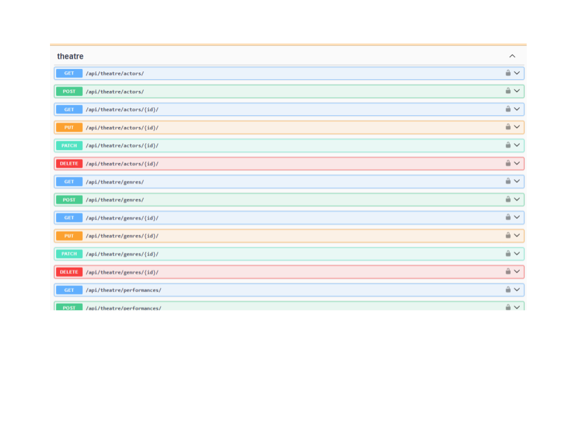
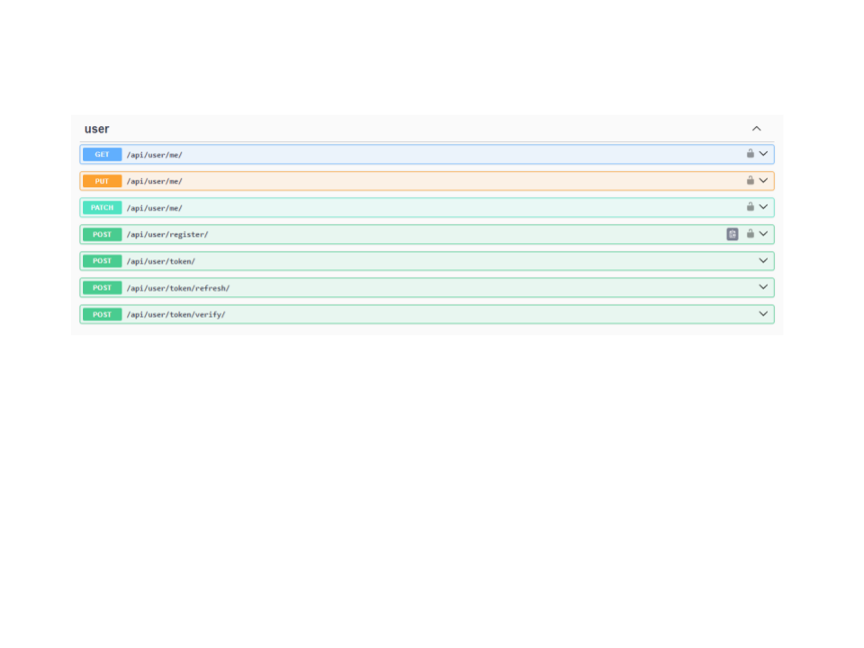

# theatre_api-service
 A theater API project that allows theatergoers to book tickets online 
 and select their desired seats without physically visiting the theater.
 This project written on DRF.

## Installation
To get started with the Theatre API Service, 
you need to clone the repository and install the necessary dependencies.
```
git clone https://github.com/dkotkod/theatre_api-service.git
cd theatre_api-service
```

Create a branch for the solution and switch on it
```
git checkout -b develop
```

If you are using PyCharm - it may propose you to automatically create venv for your project and install requirements in it, but if not:
```
python -m venv venv
venv\Scripts\activate (on Windows)
source venv/bin/activate (on macOS)
pip install -r requirements.txt
```

By default, use the following superuser.
```
username: user@user.com
password: 5577user
```

## Run with Docker

Docker should be installed on your system to run the service using Docker.

1.Build the Docker image:
```
docker-compose build
```

2.Start the service:
```
docker-compose up
```

## What is implemented in the project:
- JWT authentication
- Transaction
- The database has been migrated from SQL to Postgresql
 - Admin panel /admin/
 - Documentation is located at:
   - /api/doc/swagger/
   - /api/doc/redoc/
 - Managing tickets
## Theater application endpoints example.

## User application endpoints example
